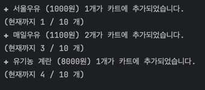

# 🛒 Java CLI 기반 마트 서비스 프로그램

## 프로젝트 소개

- 마트에서 가능한 상품 진열, 상품 담기, 결제 행동을 수행하고, 영수증을 출력하는 프로그램입니다.
- ``Command Line Interface`` 기반으로 제작되었습니다.
- 객체지향이 무엇인지 직접 제작함으로써 체화하는 것과 팀워크를 도모하는 것을 주목적으로 진행되었습니다.

## 개발 기간

- 2024-03-20 ~ 2024-03-26

## 팀원 구성

|                                                                **최문영**                                                                 |                                                                **안지수**                                                                 |                                                                **김태민**                                                                 |                                                                **하정훈**                                                                 |                                                                **천문기**                                                                 |
|:--------------------------------------------------------------------------------------------------------------------------------------:|:--------------------------------------------------------------------------------------------------------------------------------------:|:--------------------------------------------------------------------------------------------------------------------------------------:|:--------------------------------------------------------------------------------------------------------------------------------------:|:--------------------------------------------------------------------------------------------------------------------------------------:|
|  |  |  |  |  |

## 1.개발 환경

- Java버전 : JDK 17
- IDE : Intellij
- 버전 관리 : Github
- 협업 툴 : Notion, Slack
- [코드 컨벤션](https://www.notion.so/a679d2872cef45ab889763c46b3e4832)
- [커밋 컨벤션](https://www.notion.so/aed0e405bc384cb3b4a78b8e375e34d2)

## 2.브랜치 전략

- 깃에 익숙하지 않은 멤버들이 있어 `Github Flow`와 `Git Flow` 전략을 동시에 운용했습니다.
- Git Flow 전략이 편한 멤버의 경우 main, MartService 브랜치와 feature 보조 브랜치를 운용했습니다.
    - main 브랜치는 배포 단계에서만 사용합니다
    - MartService 브랜치는 develop 브랜치와 동일하게 개발 단계에서 사용하는 브랜치입니다.
    - feature 브랜치는 기능 단위로 사용하고 merge 후 브랜치를 삭제합니다.
- Github Flow 전략이 편한 멤버의 경우 main, MartService 브랜치를 운용했습니다.
- 코드 충돌이 빈번하게 발생할 가능성이 높으므로 Github Flow 전략을 이용하는 멤버에게는 각 작업 단계 시작 전에 코드를 항상 최신화할 수 있도록 했습니다.

## 3. 역할 분담

### 최문영

- **Class**
    - 사람, 카트, 돈, 카드, 계산서, 상품
- **기능**
    - 금액 결제

### 안지수

- **Class**
    - 계산원, 키오스크
- **기능**
    - 금액 계산, 계산서 출력

### 김태민

- **Class**
    - 영수증
- **기능**
    - 영수증 출력

### 하정훈

- **Class**
    - 마트 근무자
- **기능**
    - 상품 진열

### 천문기

- **Class**
    - 구매자
- **기능**
    - 상품 담기

## 4.프로젝트 목표 및 관리

### 프로젝트 목표

- 토이 프로젝트 전 팀워크 맞추기
- 객체 지향을 체화하고 활용해보기
- 익숙하지 않은 API를 활용해보기

### 프로젝트 관리

- Slack과 Notion을 사용하여 진행 상황을 공유했습니다.
- 전체 회의가 필요한 경우 Slack을 통해 공지하고, Notion에 Agenda와 회의 내용결과를 기록했습니다.
- 세세한 관리에 대해선 서로 소통을 하고 해결이 어려운 점은 그룹장 주도로 정리 및 솔루션 제공을 했습니다.

## 5.주요 기능 및 구현 내용

- 마트 근무자는 상품을 진열합니다.

  

- 구매자는 카트에 상품을 담습니다.

  

- 마트 근무자도 계산원이 될 수 있습니다.

  

- 계산원은 사람이 될 수도, 키오스크로 대체 될 수 있습니다.

  

- 계산원은 계산서를 출력합니다.

  

- 결제는 현금 또는 카드를 사용할 수 있습니다.

  

- 결제 후에는 영수증이 출력됩니다.
    
    - 현금 결제시, 받은금액과 거스름돈을 보여줍니다.
      
        

    - 카드 결제시, 승인번호만 보여줍니다.
      
        

## 6. KPT

### 🥰 KEEP

-
-
-

### 😵‍💫 PROBLEM

-
-
-

### 🤩 TRY

-
-
-

[프로젝트 소개로](#프로젝트-소개)

